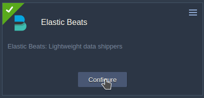

# Elastic Beats Add-On

**[Beats](https://www.elastic.co/beats/)** are open source data shippers that you can install as agents on your Virtuozzo Application Platform nodes to send operational data to the *[OpenSearch](https://github.com/jelastic-jps/opensearch-cluster)* server.

## Installation Process

[Import](https://docs.jelastic.com/environment-import/) the link of the add-on [manifest](https://github.com/jelastic-jps/beats-jps-addon/blob/main/manifest.yml) within the PaaS dashboard or initiate the installation via **Marketplace > Add-Ons**.

> **Note:** To access the dashboard, you need to be registered at one of the [Public Cloud](https://www.virtuozzo.com/application-platform-partners/) providers or have a Private Cloud installation.

You can deploy the ***Elastic Beats*** add-on on any node (except *alpine-based* ones) created inside the platform. Within the installation window, you need to specify the credentials to connect to the OpenSearch cluster (or custom Docker with the ElasticSearch instance) and choose between two add-on versions:

- ***7.12.1*** - to ship data directly to OpenSearch (see [compatibility charts](https://opensearch.org/docs/latest/clients/agents-and-ingestion-tools/index/))

> **Note:** For direct connection, you need to add the following line to the OpenSearch config and restart the node:
> *compatibility.override_main_response_version: true*

- ***latest*** - to ship data to OpenSearch through Logstash

  

During installation, you need to provide the following data:

- ***Installed Agents*** - choose the required Beats types:
  - **[Filebeat](https://www.elastic.co/beats/filebeat)** - forwards and centralizes logs and files. Pre-sets are already available for many certified nodes: *Apache* (all), *NGINX* (all), *HAProxy*, *Redis*, *Postgres*, *MySQL*, *MariaDB*, *Percona*, *MongoDB*. *[Tomcat/TomEE](https://arshpunia.medium.com/using-filebeat-to-ship-tomcat-logs-to-elasticsearch-7e4325373c7a)* requires special configurations.
  - **Metricbeat** - collects metrics from your systems and services.
  - **Journalbeat** - forwards and centralizes log data from *systemd journals*. Installed as an agent on your servers, Journalbeat monitors the journal locations that you specify, collects log events, and forwards them to *OpenSearch* or *Logstash*.
  - **Packetbeat** - monitors your network traffic to ensure high performance and security. Packetbeat is a lightweight network packet analyzer.
  - **Heartbeat** - monitors services for their availability with active probing. It checks response time and, if the given URLs are alive, then ships this information to other stacks for further analysis.
- ***Beats OSS Version*** - choose the desired version of the agent
- ***OpenSearch Host*** - enter the OpenSearch (or Elasticsearch) host
- ***Credentials*** - provide access information for the specified OpenSearch host (*User* and *Password*)
- ***OpenSearch Dashboards Host*** - enter the OpenSearch Dashboards host (may be needed for visualization purposes)
- ***Logstash Host*** - enter the Logstash host (if interconnection is done through the Logstash)

> **Note:** Simultaneously sending data to OpenSearch and Logstash outputs is **not supported** - only one output can be used at once. If you want to pass the data through the LogStash - please specify only the *LogStash* host and port (the OpenSearch data is unnecessary).

- ***Environment name*** - choose the target environment
- ***Nodes*** - choose the target layer

If needed, these settings can also be re-adjusted for the already installed add-ons using the **Configure** button.

  

Refer to the **[OpenSearch Cluster](https://docs.jelastic.com/opensearch-cluster/)** documentation for more information.
